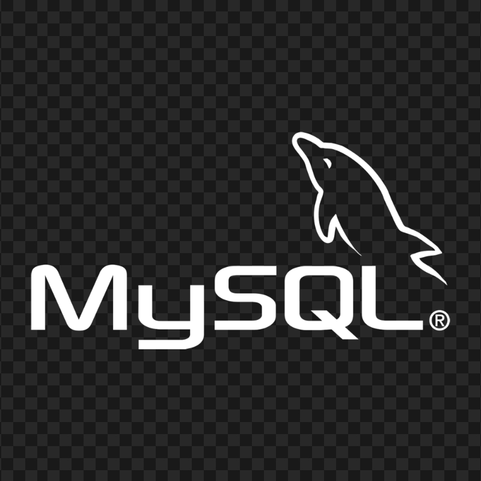

# Portifolio - Victor Fernandes

## 📑 Sumário

-  [Sobre Mim](#sobre-mim)
-  [Instalação](#-instalação)
-  [Uso](#-uso)
-  [Scripts úteis](#-scripts-úteis)
-  [Tecnologias Utilizadas](#tecnologias-utilizadas)
-  [Features](#-features)
-  [Prints](#-prints)
-  [Deploy](#-deploy)
-  [Contato](#contato)
-  [Licença](#-licença)

## 👤 Sobre Mim

Desenvolvedor Full Stack apaixonado por tecnologia, com experiência em React, Next.js, Node.js e design responsivo.
Sempre buscando novos desafios e aprendizados!


Portfólio profissional desenvolvido em Next.js, React e Tailwind CSS, apresentando projetos, experiências e habilidades.

## 🚀 Instalação

```bash
git clone https://github.com/victorrony/portifolio.git
cd portifolio
npm install
```

## 🖥️ Uso

```bash
npm run dev
# ou
yarn dev
```

Acesse: http://localhost:3000

## 🛠️ Scripts úteis

-  `npm run dev` — inicia o ambiente de desenvolvimento
-  `npm run build` — build de produção
-  `npm run start` — inicia o servidor de produção
-  `npm run lint` — executa o linter
-  `npm run format` — formata o código com Prettier

## Tecnologias Utilizadas

<div style="display: flex; gap: 10px; align-items: center; flex-wrap: wrap;">
  
  
  
  
  
  
  
  
</div>

## ✨ Features

-  Listagem de projetos
-  Linha do tempo de experiências
-  Skills e ferramentas
-  Responsivo e acessível
-  Deploy automático via Vercel

## 📸 Prints

 

## 📦 Deploy

Deploy automático via [Vercel](https://vercel.com/).

## Contato

-  [LinkedIn](https://www.linkedin.com/in/victorfernandes-a41030262/)
-  [GitHub](https://github.com/victorrony)
-  [WhatsApp](https://wa.me/+2319519228)

## 📄 Licença

MIT
